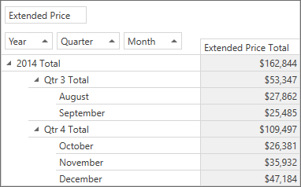

<!-- default badges list -->

<!-- default badges end -->
# Pivot Grid for WPF - How to Group Date-Time Values

This example shows how to group date-time values.

Multiple Pivot Grid fields are bound to the same data field - OrderDate. The [DataSourceColumnBindingBase.GroupInterval](https://docs.devexpress.com/CoreLibraries/DevExpress.PivotGrid.DataBinding.DataSourceColumnBindingBase.GroupInterval) property is used to create a Year → Quarter → Month hierarchy.  

## Files to Review:

* [MainWindow.xaml](./CS/HowToGroupDateTime/MainWindow.xaml) (VB: [MainWindow.xaml](./VB/HowToGroupDateTime/MainWindow.xaml))
* [MainWindow.xaml.cs](./CS/HowToGroupDateTime/MainWindow.xaml.cs) (VB: [MainWindow.xaml.vb](./VB/HowToGroupDateTime/MainWindow.xaml.vb))

## Documentation

[Grouping](https://docs.devexpress.com/WPF/8061/controls-and-libraries/pivot-grid/data-shaping/grouping)

## More Examples

[Pivot Grid for WPF - Custom Group Intervals](https://github.com/DevExpress-Examples/how-to-implement-custom-group-intervals-e2132)

<!-- feedback -->
## Does this example address your development requirements/objectives?

 

(you will be redirected to DevExpress.com to submit your response)
<!-- feedback end -->
