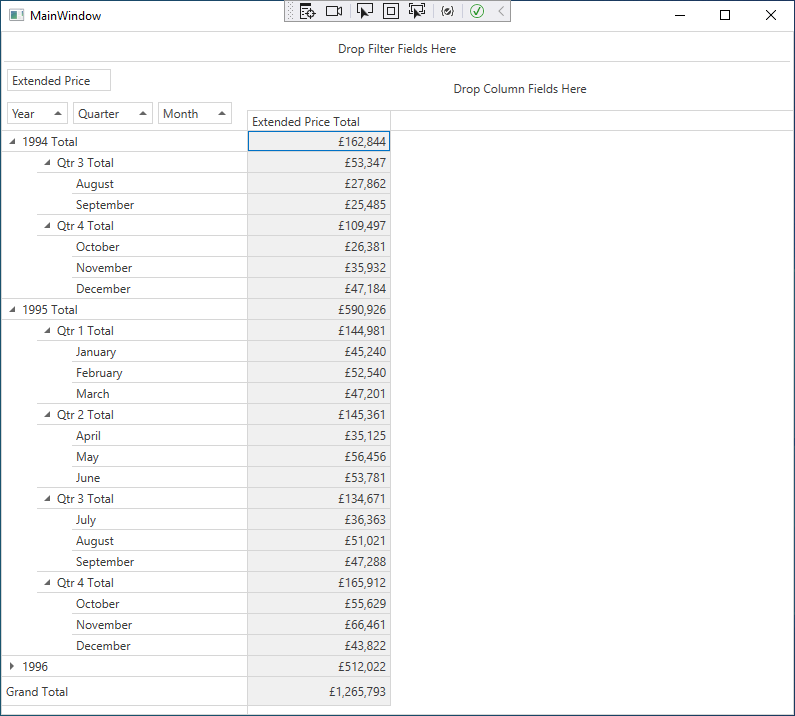

<!-- default badges list -->

<!-- default badges end -->
# Pivot Grid for WPF - How to Group Date-Time Values

This example shows how to group date-time values.

In the example, the [PivotGridControl](https://docs.devexpress.com/WPF/DevExpress.Xpf.PivotGrid.PivotGridControl) contains three [PivotGridField](https://docs.devexpress.com/WPF/DevExpress.Xpf.PivotGrid.PivotGridField) fields (*fieldYear*, *fieldQuarter* and *fieldMonth*) in the Row Area. Each of the field is bound to the "OrderDate" data field. The *fieldYear* pivot grid field's values are grouped by years, the *fieldQuarter* field's values are grouped by quarters, and the *fieldMonth* pivot grid field's values are grouped by months. To specify the field's group interval, use the binding’s [DataSourceColumnBindingBase.GroupInterval](https://docs.devexpress.com/WPF/DevExpress.Xpf.PivotGrid.DataSourceColumnBinding.GroupInterval) property.

## Files to Look At

- [MainWindow.xaml](./CS/HowToGroupDateTime/MainWindow.xaml) (VB: [MainWindow.xaml](./VB/HowToGroupDateTime/MainWindow.xaml))
- [MainWindow.xaml.cs](./CS/HowToGroupDateTime/MainWindow.xaml.cs) (VB: [MainWindow.xaml.vb](./VB/HowToGroupDateTime/MainWindow.xaml.vb))

## Documentation

- [Grouping in Pivot Grid](https://docs.devexpress.com/WPF/8061/controls-and-libraries/pivot-grid/data-shaping/grouping)

## More Examples

- [Pivot Grid for Web Forms - How to Group Date-Time Values](https://github.com/DevExpress-Examples/how-to-group-date-time-values-e1875)

